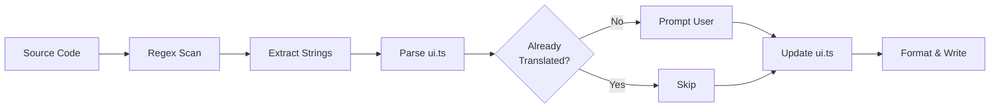

# Gettext-Style i18n Implementation

This document explains the technical implementation of the inline translation system (gettext-style workflow) for this Astro project.

## Overview

This implementation adds a Python Babel-like workflow to the existing Astro i18n system, allowing developers to write English text directly in code using `_("text")` syntax, then extract and translate it via a CLI tool.

## Architecture

### Components

1. **Runtime Function** (`src/i18n/inline.ts`)

   - Exports `getInlineTranslations(lang)`
   - Returns `_(text)` function that converts English text to keys
   - Falls back to English text if translation missing

1. **Extraction Script** (`scripts/i18n-extract.js`)

   - Scans `.astro`, `.tsx`, `.ts` files for `_()` calls
   - Uses regex to extract string literals
   - Interactive CLI prompts for translations
   - Updates `src/i18n/ui.ts` automatically

1. **Translation Storage** (`src/i18n/ui.ts`)

   - Existing structure maintained
   - Keys prefixed with `inline.*` for extracted strings
   - TypeScript `as const` for type safety

### Key Generation Algorithm

```javascript
function textToKey(text) {
  return text
    .toLowerCase()                    // "Hello World" → "hello world"
    .replace(/[^a-z0-9]+/g, "_")     // "hello world" → "hello_world"
    .replace(/^_+|_+$/g, "")         // Trim underscores
    .substring(0, 80);                // Limit length
}
```

Examples:

- `"Welcome to Our Site"` → `inline.welcome_to_our_site`
- `"24/7 Support Available"` → `inline.24_7_support_available`
- `"E-commerce Solutions"` → `inline.e_commerce_solutions`

### Extraction Process



1. **Scan**: Glob pattern matches `src/**/*.{astro,tsx,ts}`
1. **Extract**: Regex `/\b_\(\s*["'`\](\[^"'`]+)["'`\]\\s\*)/g`finds all`\_()\` calls
1. **Parse**: Read existing `ui.ts` to avoid duplicates
1. **Prompt**: Interactive CLI using `inquirer` library
1. **Merge**: Combine new + existing translations
1. **Sort**: Manual keys first, then inline keys alphabetically
1. **Write**: Regenerate `ui.ts` with updated content

### File Structure

```
src/
├── i18n/
│   ├── index.ts          # Exports both t() and _()
│   ├── inline.ts         # NEW: getInlineTranslations()
│   ├── ui.ts             # Translation storage (auto-updated)
│   └── utils.ts          # Existing getTranslations()
└── components/
    └── examples/
        └── InlineTranslationExample.astro  # NEW: Usage example

scripts/
└── i18n-extract.js       # NEW: Extraction tool

docs/
└── i18n-inline-translation.md  # NEW: User guide
```

## Dependencies

- **glob** (`^13.0.6`) - File pattern matching for source scanning
- **inquirer** (`^14.1.0`) - Interactive CLI prompts for translations

Note: `i18next-parser` was considered but is deprecated. We built a custom solution tailored to this project's needs.

## Type Safety

The `ui.ts` file uses TypeScript's `as const` assertion:

```typescript
export const ui = {
  en: {
    "inline.welcome": "Welcome",
    // ...
  },
  ua: {
    "inline.welcome": "Ласкаво просимо",
    // ...
  },
} as const;
```

This ensures:

- Autocomplete for all translation keys
- Compile-time type checking
- No runtime key typos

The `_()` function returns `string` (not literal types) because the English text fallback makes the return type unpredictable at compile time.

## Regex Pattern Explained

```javascript
/\b_\(\s*["'`]([^"'`]+)["'`]\s*\)/g
```

- `\b_` - Word boundary + underscore (function name)
- `\(` - Opening parenthesis
- `\s*` - Optional whitespace
- `["'`\]\` - Quote character (double, single, or backtick)
- `([^"'`\]+)\` - **Capture group**: one or more non-quote characters
- `["'`\]\` - Closing quote (must match opening)
- `\s*` - Optional whitespace
- `\)` - Closing parenthesis
- `/g` - Global flag (find all matches)

**Matches:**

- `_("text")`
- `_('text')`
- `` _(`text`) ``
- `_( "text" )` (with spaces)

**Does NOT match:**

- `_(variable)` - no quotes
- `_("text with " quotes")` - embedded quotes (limitation)
- `t("text")` - different function name

## Parsing ui.ts

The extraction script uses a **naive regex approach** to parse `ui.ts`:

```javascript
/"([^"]+)":\s*"([^"]*(?:\\.[^"]*)*)"/g
```

This works for the current format but has limitations:

- Cannot handle complex nested objects
- Assumes specific formatting (key-value pairs on single lines)
- Escapes in values must be handled carefully

**Why not AST parsing?**

- Simpler, faster for this use case
- ui.ts structure is controlled and predictable
- No need for heavy parser dependencies

If the format becomes more complex, consider switching to `@babel/parser` or similar.

## Interactive Prompts

Uses `inquirer` for user-friendly CLI:

```javascript
await inquirer.prompt([
  {
    type: "input",
    name: "ukrainian",
    message: `Ukrainian translation for "${text}":`,
    validate: (input) => input.trim() !== "" || "Translation cannot be empty",
  },
]);
```

Features:

- Shows English text + source file locations
- Validates non-empty input
- Preserves existing translations as defaults
- Skips already-translated strings

## Edge Cases & Limitations

### Current Limitations

1. **No template literal interpolation**

   ```javascript
   ❌ _(`Hello ${name}`)  // Won't extract correctly
   ✅ _("Hello") + " " + name
   ```

1. **No multi-line strings**

   ```javascript
   ❌ _("This is a very long string that
        spans multiple lines")
   ✅ _("This is a very long string that spans multiple lines")
   ```

1. **No embedded quotes**

   ```javascript
   ❌ _("He said "hello"")  // Regex breaks
   ✅ _("He said 'hello'")  // Single quotes inside double quotes OK
   ```

1. **No computed strings**

   ```javascript
   ❌ _(someVariable)
   ❌ _("Hello " + "World")
   ✅ _("Hello World")
   ```

### Collision Handling

If two different English strings generate the same key (rare), the extraction script will:

- Detect the collision
- Show both strings to the user
- Require manual resolution in `ui.ts`

Example collision (theoretical):

- `"Hello, World!"` → `inline.hello_world`
- `"Hello World!"` → `inline.hello_world` (same key)

### Sorting Strategy

Keys are sorted in two groups:

1. **Manual keys** (no `inline.` prefix) - alphabetically
1. **Inline keys** (`inline.*` prefix) - alphabetically

This keeps manual keys at the top for easier manual editing, while inline keys are grouped together.

## Performance Considerations

### Extraction Speed

- **File scanning**: O(n) where n = number of source files
- **Regex matching**: O(m) where m = file content length
- **Typical performance**: ~100-200 files in \< 2 seconds

### Runtime Performance

The `_()` function performs:

1. String transformation (lowercase, regex replace): ~0.001ms
1. Map lookup in `ui` object: O(1)

No measurable performance impact vs. manual `t("key")`.

## Testing Strategy

### Manual Testing Checklist

- [ ] Create new component with `_()` calls
- [ ] Run `npm run i18n:extract:dry` - verify detection
- [ ] Run `npm run i18n:extract` - enter translations
- [ ] Check `ui.ts` updated correctly
- [ ] Build project - TypeScript compiles
- [ ] Run app - translations display correctly
- [ ] Test both English and Ukrainian routes

### Example Test Component

See `src/components/examples/InlineTranslationExample.astro` for a full working example.

## Migration Path

### Phase 1: Coexistence (Current)

- Both `t()` and `_()` work
- New code uses `_()`
- Old code unchanged

### Phase 2: Gradual Migration

- Convert components when editing them
- No rush - both patterns maintained

### Phase 3: Full Migration (Optional)

- Write migration script to convert all `t()` → `_()`
- Delete manual keys from `ui.ts`
- Simplify codebase

## Troubleshooting

### "Could not parse ui.ts file structure"

The extraction script expects this exact format:

```typescript
export const ui = {
  en: {
    // keys here
  },
  ua: {
    // keys here
  },
} as const;
```

If you manually restructure the file, the regex parser may fail. Keep the format consistent.

### "No \_() calls found"

Check:

1. Files are in `src/` directory
1. Using `_()` not `t()`
1. Strings are in quotes: `_("text")` not `_(variable)`
1. File extensions are `.astro`, `.tsx`, or `.ts`

### Extraction misses some strings

The regex is not perfect. It may miss:

- Template literals with interpolation
- Multi-line strings
- Strings with complex escaping

Manually add these to `ui.ts` if needed.

## Future Enhancements

Potential improvements:

1. **AST-based parsing** - More robust than regex
1. **Plural support** - `_n("item", "items", count)`
1. **Context support** - `_c("Close", "button")` vs `_c("Close", "proximity")`
1. **CI integration** - Fail build if untranslated strings exist
1. **Translation memory** - Suggest similar existing translations
1. **AI translation** - Auto-generate Ukrainian translations via API
1. **Watch mode** - Auto-extract on file save during development
1. **VSCode extension** - Inline translation preview in editor

## References

- [Python Babel](https://babel.pocoo.org/) - Inspiration for this workflow
- [gettext](https://www.gnu.org/software/gettext/) - Original i18n system
- [i18next](https://www.i18next.com/) - Popular JS i18n library
- [Astro i18n Guide](https://docs.astro.build/en/recipes/i18n/)

## Changelog

### 2026-08-23 - Initial Implementation

- Created `src/i18n/inline.ts`
- Created `scripts/i18n-extract.js`
- Added npm scripts: `i18n:extract`, `i18n:extract:dry`
- Added documentation and examples
- Installed dependencies: `glob`, `inquirer`

______________________________________________________________________

**Maintainer Notes:**

This system was designed to feel like Python's Babel but adapted for TypeScript/Astro. The key design decisions were:

1. **No build-time transformation** - Runtime function for simplicity
1. **Keep existing ui.ts format** - Minimize breaking changes
1. **Manual extraction** - More control than automatic
1. **TypeScript safety** - Leverage existing type system

If you need to make changes, the extraction script is the most complex part. The runtime `_()` function is simple and stable.
